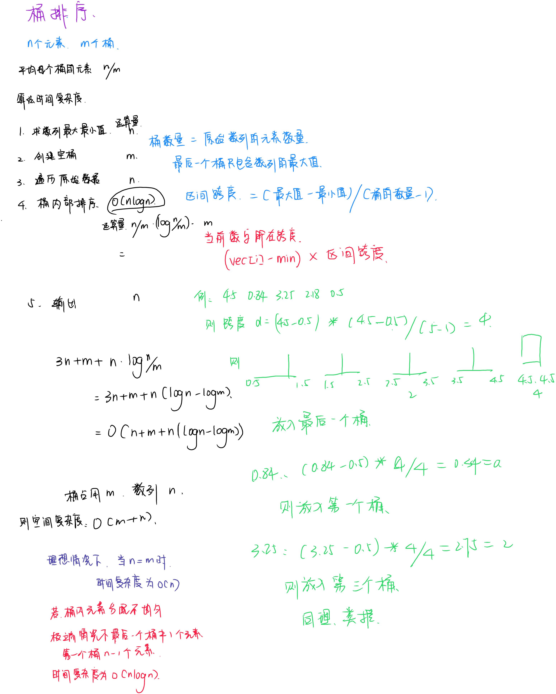

# 桶排序
---


---

``` c++
#include <iostream>
#include <algorithm>
#include <vector>

using namespace std;

/**
 * @brief 桶排序，
 * 
 * @param vec 要排序的数组
 * @return vector<double> 排序好的数组
 */
vector<double> bucksort(vector<double> &vec)
{
    //当数组长度小于2时就返回，因为没有排序的必要
    if(vec.size() < 2)
    {
        return vec;
    }
    //1.遍历查找到数组的最大和最小值
    double max = vec[0];
    double min = vec[0];
    for(int i = 0; i < vec.size(); i++)
    {
        if(vec[i] > max)
        {
            max = vec[i];
        }
        if(vec[i] < min)
        {
            min = vec[i];
        }
    }
    
    //2.初始化桶
    int bucketNum = vec.size();//获取待排序数组的长度
    vector<vector<double>> bucket(bucketNum);//初始化一个二元vector数组用于作为桶

    //区间跨度
    int d = (max - min) / (bucketNum - 1);// -1 是因为最后一个桶只放最大数本身

    //3.遍历原始数组
    for(int i = 0; i < vec.size(); i++)
    {
        int temp = (vec[i] - min) * d;//获得当前数字所在跨度
        bucket[temp].push_back(vec[i]);//将数字放到对应的桶里面去
    }

    //4.对每个桶内部进行排序
    for(int i = 0; i < bucket.size(); i++)
    {
        //使用STL提供的排序算法
        sort(bucket[i].begin(), bucket[i].end());
    }

    //5.将排序好的元素复制给sortedVec
    vector<double> sortedVec(vec.size());
    int index = 0;
    for(vector<double> v : bucket)
    {
        for(double e : v)
        {
            sortedVec[index++] = e;
        }
    }
    return sortedVec;
}

int main(int argc, char const *argv[])
{
    vector<double> vec{4.5, 0.84, 3.25, 2.18, 0.5};
    vector<double> sortedVec = bucksort(vec);
    for(int i = 0; i < sortedVec.size(); i++)
    {
        cout << sortedVec[i] << " ";
    }
    return 0;
}

```