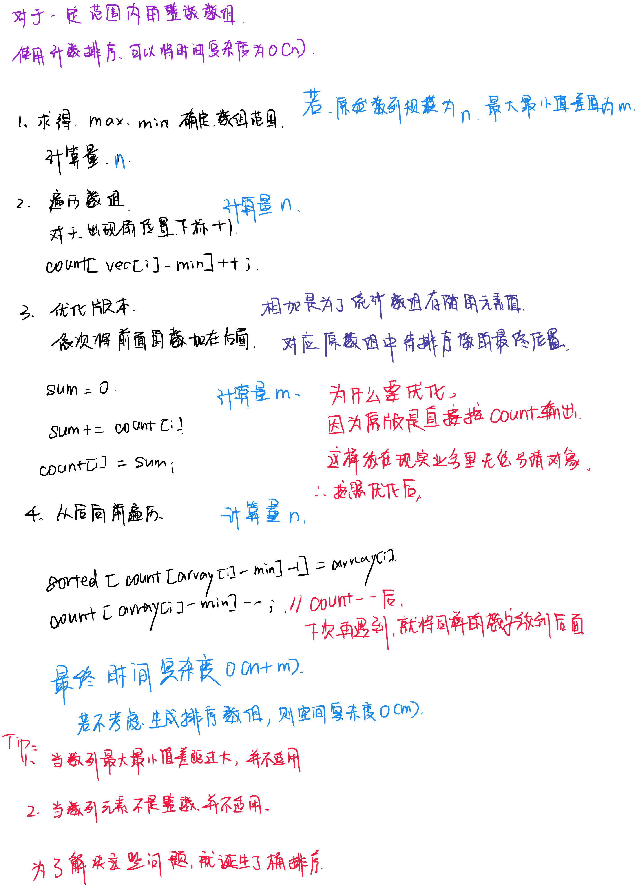

# 计数排序
---



---

``` c++
#include <iostream>
#include <algorithm>
#include <vector>

using namespace std;

/**
 * @brief 计数排序
 * 
 * @param vec 待排序的数组
 * @return vector<int> 完成排序的数组
 */
vector<int> CountSort(vector<int> &vec)
{
    //当数组长度小于2时，没有必要排序
    if(vec.size() < 2)
    {
        return vec;
    }
    //1.获取最大最小值
    int max = vec[0];
    int min = vec[0];
    for(int i = 0; i < vec.size(); i++)
    {
        if(max < vec[i])
        {
            max = vec[i];
        }
        if(min > vec[i])
        {
            min = vec[i];
        }
    }

    //2.创建计数数组并统计元素个数
    vector<int> count(max - min);
    int sum = 0;//用于后面优化
    for(int i = 0; i < vec.size(); i++)
    {
        count[vec[i] - min]++;//对应计数数组下标增加1
    }

    //3.对计数数组进行累加，后面的元素等于前面的元素之和
    for(int i = 0; i < vec.size(); i++)
    {
        sum += count[i];
        count[i] = sum;
    }

    //4.倒序遍历数组，从计数数组中找到对应的位置，并复制到结果数组中
    vector<int> sortedVec(vec.size());
    for(int i = vec.size()-1; i >= 0; i--)
    {
        sortedVec[count[vec[i]-min]-1] = vec[i];//将数字从计数数组中查找并放在对应位置
        count[vec[i]-min]--;//计数数组中位置-1,后面再次遇到时就是位置往后挪了
    }

    return sortedVec;
}

int main(int argc, char const *argv[])
{
    vector<int> vec{95,94,91,98,99,90,99,93,91,92};
    vector<int> sortedVec = CountSort(vec);
    for(int i = 0; i < sortedVec.size(); i++)
    {
        cout << sortedVec[i] << " ";
    }
    return 0;
}

```