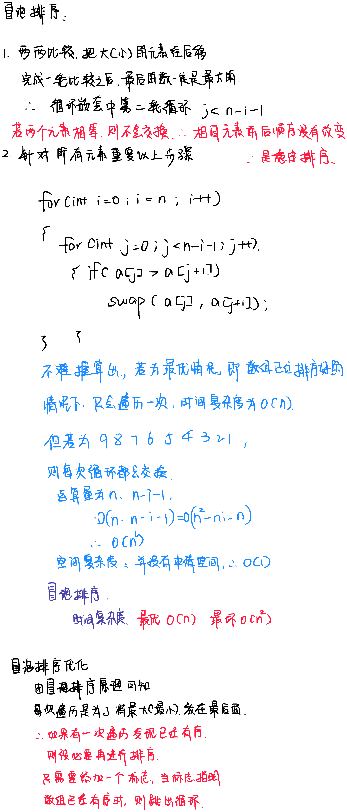

# 冒泡排序


### 实现代码
```c++
#include <iostream>
#include <vector>

using namespace std;

/**
 * @brief 冒泡排序
 * 
 * @param vec 
 */
void BubbleSort(vector<int> &vec)
{
    int length = vec.size();
    int temp = 0;
    for(int i = 0; i < length; i++)
    {
        for(int j = 0; j < length - i - 1; j++)
        {
            if(vec[j] > vec[j+1])
            {
                temp = vec[j];
                vec[j] = vec[j+1];
                vec[j+1] = temp;
            }
        }
    }
}

/**
 * @brief 冒泡排序优化版本
 * 根据冒泡排序原理，只要一边遍历之后发现已经完成排序
 * 则没有必要继续进行
 * 
 * @param vec 
 */
void BubbleSort_Pro(vector<int> &vec)
{
    int length = vec.size();
    int temp = 0;
    int flag = 0;
    for(int i = 0; i < length; i++)
    {
        flag = 0;
        for(int j = 0; j < length - i - 1; j++)
        {
            if(vec[j] > vec[j+1])
            {
                temp = vec[j];
                vec[j] = vec[j+1];
                vec[j+1] = temp;
                flag = 1;
            }
        }
        if(flag == 0)
        {
            cout << "已完成优化冒泡排序" << endl;
            break;
        }
    }
}

void Display(const vector<int> &vec) 
{
    for(int i = 0; i < vec.size(); i++)
    {
        cout << vec[i] << " ";
    }
    cout << endl;
}

int main(int argc, char const *argv[])
{
    vector<int> vec = {9,8,7,6,5,4,3,2,1};
    vector<int> vecP = {1,2,3,4,5,6,7,8,9};
    BubbleSort(vec);
    BubbleSort_Pro(vecP);
    Display(vec);
    return 0;
}

```